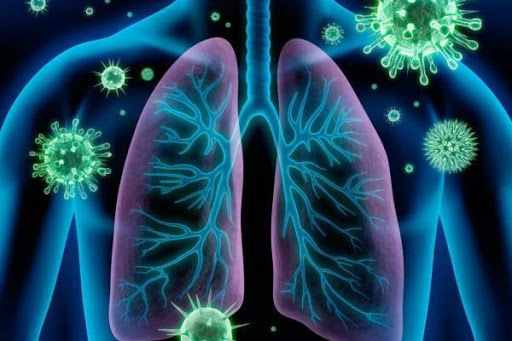

# SRAG - Agrupamento e Detecção de Anomalias

Este é um trabalho para a disciplina de Sistemas de Apoio à Decisão do curso de Sistemas de Informação da Universidade Federal de Ouro Preto.

A base de dados disponibilizada pelo governo diz respeito a Casos de Síndrome Respiratória Aguda Grave Hospitalizados. Para este trabalho iremos trabalhar com uma amostragem de 1000 registros aleatórios. 

A SRAG é um agravamento de infecções respiratórias. Os sintomas geralmente são febre de início súbito, mesmo que referida, acompanhada de tosse ou dor de garganta e pelo menos um dos sintomas: mialgia, cefaleia ou artralgia.

A evolução para Síndrome Respiratória Aguda acontece quando o paciente apresenta os sintomas acima e mais algum dos sintomas abaixo:

• Dispneia;

• Desconforto respiratório;

• Insuficiência respiratória;

• Saturação de oxigênio menor que 95%;

• Exacerbação de doença preexistente.
